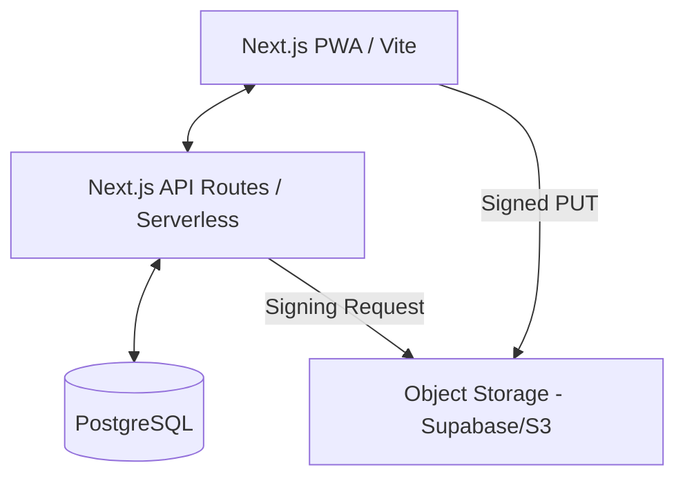

# Architecture: Lyra's Technical Blueprint

This document specifies the technical implementation details for the Cat Health Tracker MVP, bridging the **Product Shape** (Soren) and the **Nova Foundation** (Nova).

---

## 1. System Map

### Components
- **Frontend**: React-based SPA. Uses `react-query` for state, `tailwind` for styling (per Soren's calm palette), and `lucide-react` for mood icons.
- **Backend API**: REST endpoints for CRUD on Cats and Entries.
- **Database**: PostgreSQL with Row-Level Security (RLS) or ownership checks via `owner_id`.
- **Storage**: Direct-to-bucket uploads for 100% photo reliability.

---

## 2. Service Layers (Logic Map)

### Auth & Ownership Service
- Manages user session (Magic Link).
- **Hard Rule**: Every request MUST include a valid `owner_id`.
- Guards `cat_id` resources to ensure users only see their own cat.

### Photo Service (The "Visual Moat")
- **GenerateSignedUrl**: Validates `cat_id` and date, then issues a 60-second storage URL.
- **Cleanup**: (Post-V1) Scans for storage keys without database records.

### Entry Service (The "Logging Heart")
- **UpsertEntry**: 
  1. Transaction Start.
  2. Map `vibe_score` integer to database record.
  3. Validate `date` unique constraint (one entry per cat/date).
  4. Link `storage_key`.
  5. Transaction Commit.

---

## 3. "Swipe-to-Log" Logic Specification

### Interaction Flow
1. **Trigger**: Floating Action Button (FAB) on Timeline.
2. **Step A (Photo)**: Open system camera/gallery. Upload begins immediately on selection.
3. **Step B (Vibe)**: While upload progresses, user swiped through the 5 Mood Icons.
4. **Step C (Note)**: Optional text area.
5. **Success**: "Log" button becomes active ONLY once upload is confirmed by Storage.

### Frontend States
- `IDLE`: Showing Timeline.
- `CAPTURING`: File selected, uploading...
- `LOGGING`: Selecting vibe/note.
- `SYNCING`: Submitting JSON check-in to `/entry`.

---

## 4. Implementation Roadmap (Phases for Atlas)

### Phase 1: The Skeleton (Runnable Goal: Onboarding works)
- Set up Next.js + DB schema.
- Implement `POST /cat`.
- Basic cat name landing page.

### Phase 2: The Loop (Runnable Goal: First Photo Log)
- Setup Storage Bucket and Auth hook.
- Implement `/entry/photo/signed-url`.
- Implement `POST /entry` with unique date constraint.

### Phase 3: The Archive (Runnable Goal: Vertical Timeline)
- Implement `GET /timeline`.
- Render newest-first feed of photos + vibes.

---

## 5. Technical Debt & Choices
- **Pagination**: Simple `limit/offset` for V1. Cursor-based deferred to V2.
- **Caching**: No heavy SWR/Query caching for V1 to ensure data fresh-ness.
- **Error Handling**: Simple toast notifications for failed uploads. No retry logic in V1.
